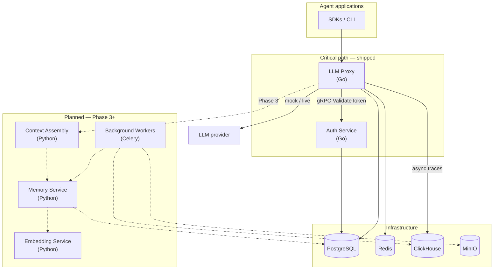

import { Brain, Gauge, Shield, Waypoints } from "lucide-react";

IBEX Harness is a distributed platform for persistent agent memory, intelligent context assembly, and behavioral consistency. Agent applications call a low-latency [LLM proxy](/docs/proxy/overview); the proxy authenticates every request through the [auth service](/docs/auth/overview), applies org directives and session context, then forwards to a mock or live provider.

<Callout type="info" title="Late Phase 2 honest scope">
  **Live today:** Go proxy and auth, Postgres RLS, Redis (rate limits, auth cache, idempotency), mock/live chat forwarding, directives, sessions, optional ClickHouse traces. **Not yet live:** Python memory, context assembly, workers, and dashboard. Dashed nodes below are Phase 3+.
</Callout>

## System diagram

The **critical path** is every LLM request: authenticate, enforce limits, resolve directive/session, call the provider, stream the response. Target proxy overhead is under 20ms (p99) excluding provider latency. Trace emission and future memory extraction must never block inference.

## Design principles

<FeatureGrid
  features={[
    {
      icon: Gauge,
      title: "Performance first",
      description:
        "The proxy path is optimized for millisecond budgets. Auth validation has a 50ms gRPC deadline; auth cache and Redis timeouts keep the hot path bounded.",
    },
    {
      icon: Shield,
      title: "Security by default",
      description:
        "org_id comes from the verified token, never the request body. Postgres RLS, Redis key namespacing, and permission bitmaps enforce isolation at every layer. Cross-tenant misses return 403, not 404.",
    },
    {
      icon: Waypoints,
      title: "Fail gracefully",
      description:
        "Auth unreachable → fail closed (503). Redis down → rate limit fail-open; auth cache skips wrap. ClickHouse down → traces drop, chat continues.",
    },
    {
      icon: Brain,
      title: "Observable everything",
      description:
        "Structured JSON logs with request_id, Prometheus metrics on bounded labels, OpenTelemetry traces, and optional ClickHouse llm_traces batches.",
    },
  ]}
/>

## What runs synchronously vs async

<ProcessSteps
  steps={[
    {
      title: "Synchronous (blocks the agent)",
      description:
        "Token validation, agent identity check, rate limiting, directive resolve, chat parse, provider call, and response streaming.",
    },
    {
      title: "Asynchronous (never blocks)",
      description:
        "ClickHouse trace emission, session checkpoint writes, and (Phase 3+) memory extraction, drift alerts, and billing counters.",
    },
    {
      title: "Today",
      description:
        "Mock or live provider forwarding is live. Memory/context assembly remain Phase 3 — do not design clients against those APIs yet.",
    },
  ]}
/>

## Latency budgets

| Operation | Budget |
| --- | --- |
| Auth `ValidateToken` gRPC | 50ms |
| Redis rate limit check | 5ms |
| Full proxy overhead (excl. LLM) | 20ms p99 |
| Context assembly (Phase 3) | 50ms p95 (planned) |

## Related

- [Services](/docs/architecture/services) — which components are live vs planned
- [Request lifecycle](/docs/architecture/request-lifecycle) — step-by-step proxy flow
- [Glossary](/docs/glossary) — PAT, RLS, org_id, and other terms
