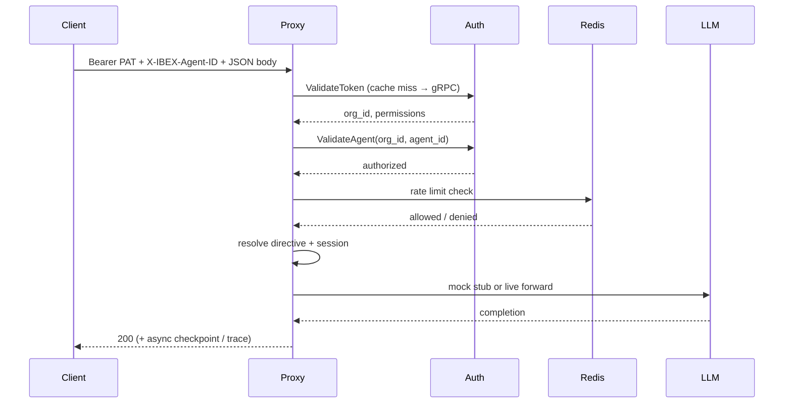
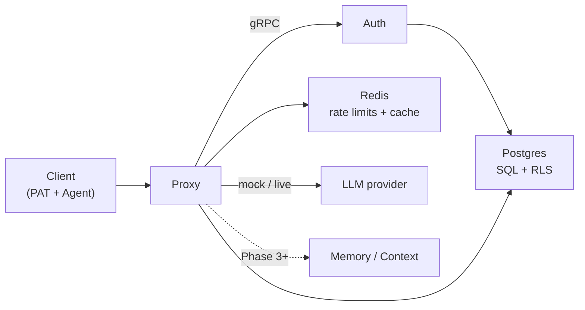

IBEX Harness separates **who** is calling (organization + agent), **what** they may do (permissions), and **where** requests go (proxy routing + provider mode). Understanding these axes is enough to integrate against the shipped auth + proxy surface.

<Callout type="info" title="Shipped vs planned">
  Auth, proxy forwarding (mock/live), directives, sessions, idempotency, auth cache, and ClickHouse traces are **shipped**. Memory injection, vector search, and the Python dashboard remain **Phase 3+**. See [current state](/roadmap/current-state).
</Callout>

## Platform vocabulary

| Term | Meaning | Status |
| --- | --- | --- |
| **Organization** | Top-level tenant; owns agents, tokens, rate limits | Shipped — [glossary](/docs/glossary) |
| **Agent** | Autonomous actor inside an org; identified per request | Shipped |
| **PAT** | Personal Access Token — `ibex_pat_*` bearer credential | Shipped |
| **RLS** | Postgres row-level security isolating tenant rows | Shipped |
| **Proxy** | HTTP edge — auth, rate limit, inject, forward | Shipped |
| **Directive** | Org behavioral instructions injected into chat | Shipped — [Directives](/docs/proxy/directives) |
| **Session** | Conversation lifecycle + checkpoints | Shipped — [Sessions](/docs/proxy/sessions) |
| **Memory** | Persistent agent knowledge store | Not shipped (Phase 3) |

## Core entities

<Steps>
  <Step title="Organization">
    Every token belongs to exactly one organization (`org_id`). Rate limits, RLS policies, and future billing boundaries scope per org. Table: `ibex_core.organizations`.
  </Step>
  <Step title="Agent">
    An agent is an autonomous actor inside an org. The proxy requires `X-IBEX-Agent-ID` on protected routes and validates it via auth gRPC `ValidateAgent`.
  </Step>
  <Step title="Token (PAT)">
    Clients authenticate with a Personal Access Token. The proxy calls `ValidateToken` (optionally via bloom+LRU cache); Argon2id verifies the secret server-side. Permissions are a 64-bit bitmap ([ADR-0009](/docs/adr/0009-permission-bitmap)).
  </Step>
  <Step title="User">
    Human operator linked to org membership. Used for token audit trails; dashboard login is future work.
  </Step>
</Steps>

Entity relationships: [Org and project model](/docs/auth/org-project-model) and [Data model](/docs/architecture/data-model).

## Request path (today)



Full lifecycle documentation: [Request lifecycle](/docs/architecture/request-lifecycle).

## Required headers

Protected proxy routes require:

```
Authorization: Bearer ibex_pat_<uuid>_<secret>
X-IBEX-Agent-ID: <agent-uuid>
Content-Type: application/json   # POST bodies only
```

Optional: `Idempotency-Key` on non-streaming chat when Redis is configured.

<CodeTabs>
  <CodeTab label="curl">
```bash
curl -X POST http://localhost:8080/v1/chat/completions \
  -H "Authorization: Bearer ${IBEX_DEV_TOKEN}" \
  -H "X-IBEX-Agent-ID: ${IBEX_DEV_AGENT_ID}" \
  -H "Content-Type: application/json" \
  -d '{"model":"gpt-4o","messages":[{"role":"user","content":"ping"}]}'
```
  </CodeTab>
  <CodeTab label="PowerShell">
```powershell
$headers = @{
  Authorization = "Bearer $env:IBEX_DEV_TOKEN"
  "X-IBEX-Agent-ID" = $env:IBEX_DEV_AGENT_ID
  "Content-Type" = "application/json"
}
Invoke-RestMethod -Uri http://localhost:8080/v1/chat/completions -Method POST -Headers $headers -Body '{"model":"gpt-4o","messages":[{"role":"user","content":"ping"}]}'
```
  </CodeTab>
</CodeTabs>

Default mock mode expected response: HTTP **200**. Use `IBEX_LLM_MODE=live` plus `OPENAI_API_KEY` for real provider responses.

<Callout type="tip" title="Org from token">
  Chat uses `POST /v1/chat/completions` without `{org_id}` in the URL. Tenant scope comes from the PAT, not the path.
</Callout>

## Provider modes

| Mode | When | Result |
| --- | --- | --- |
| `mock` (default) | Local/dev without a provider key | In-process stub → HTTP 200 |
| `live` | `OPENAI_API_KEY` set | Forward to OpenAI-compatible `/chat/completions` |

Mock is **not allowed** when `IBEX_ENV=production`. Unregistered models return `501 PROVIDER_NOT_CONFIGURED`.

## Permission model

Permissions are bitwise flags on the token. Integrators need at minimum:

| Permission | Required for |
| --- | --- |
| `ProxyChatCompletion` | Chat completion endpoint |
| `TokenCreate` | Issuing new PATs via gRPC |

Admin seed tokens include broader bits for local development. Production tokens should follow least privilege — [Authentication](/docs/security/authentication).

## Error envelope

All JSON errors share a stable shape:

```json
{
  "error": {
    "code": "RATE_LIMITED",
    "message": "Rate limit exceeded",
    "request_id": "0192a3b4-c5d6-7890-abcd-ef1234567890"
  }
}
```

Semantic validation adds `field_errors[]`. Use `request_id` to correlate with proxy and auth logs. Reference: [API errors](/docs/api-reference/errors).

## Multi-tenancy principles

<ProcessSteps
  steps={[
    {
      title: 'org_id from token',
      description: 'Never trust org_id from request body or unvalidated URL segments.',
    },
    {
      title: '403 not 404',
      description: 'Cross-tenant access returns Forbidden — ambiguous to attackers.',
    },
    {
      title: 'Defense in depth',
      description: 'Middleware, gRPC, store WHERE clauses, and Postgres RLS all enforce isolation.',
    },
    {
      title: 'Redis + ClickHouse namespacing',
      description: 'Redis keys include org_id; every ClickHouse query must filter org_id explicitly.',
    },
  ]}
/>

Details: [Tenant isolation](/docs/security/tenant-isolation) and [Multi-tenant RLS](/docs/auth/multi-tenant-rls).

## Future concepts (not yet available)

- **Context assembly** — parallel directive + memory retrieval (40ms budget)
- **Memory service** — vector search, dedup, conflict detection
- **Embedder** — text-to-vector for semantic recall
- **Worker** — async extraction, fingerprinting, drift detection

Treat these as design targets when reading [Architecture overview](/docs/architecture/overview) — not integration endpoints.

## Mental model summary



## Related guides

- [Introduction](/docs/getting-started/introduction) — what works today vs roadmap
- [Quickstart](/docs/getting-started/quickstart) — five-minute local setup
- [Auth overview](/docs/auth/overview) — gRPC surface
- [Proxy overview](/docs/proxy/overview) — middleware and endpoints
- [Glossary](/docs/glossary) — term definitions
