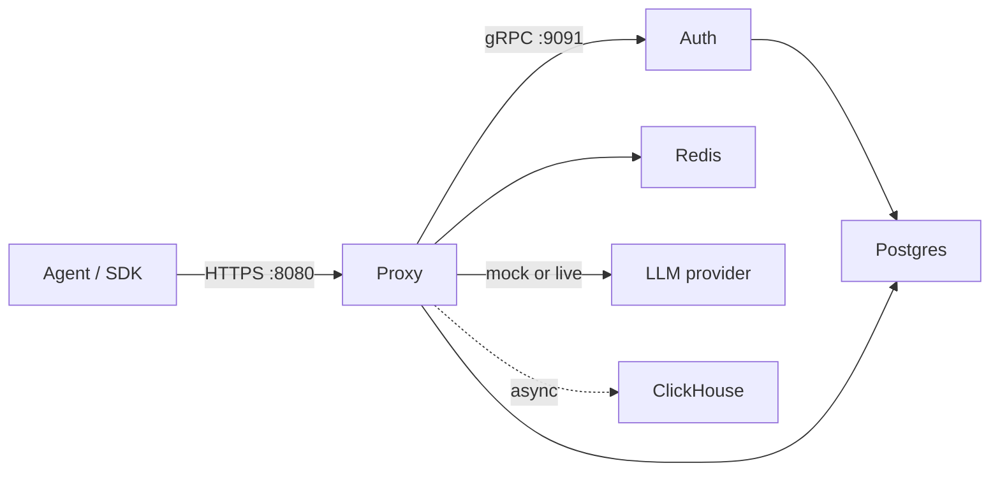

IBEX Harness is a self-hosted AI agent platform: an authenticated LLM proxy, multi-tenant identity service, and (in later phases) persistent agent memory with behavioral drift detection. The long-term goal is enterprise-grade context injection on every LLM call with under 20ms proxy overhead.

This documentation reflects **what ships on `main` today**. Auth and proxy are late Phase 2; Python memory/context/dashboard services remain Phase 3+.

<Callout type="info" title="Capability boundary">
  **Shipped:** Auth (Go), Proxy (Go) with mock/live provider modes, auth cache + revocation, directives, sessions, idempotency, and async ClickHouse traces. **Planned:** Python memory, context assembly, worker, API, and dashboard. Live status: [current state](/roadmap/current-state).
</Callout>

## What you can do today

<Steps>
  <Step title="Authenticate every proxy request">
    Bearer PAT validation and agent identity verification over gRPC — fail-closed on auth outage.
  </Step>
  <Step title="Forward chat completions">
    Default `IBEX_LLM_MODE=mock` returns HTTP 200 from an in-process stub. Set `live` plus `OPENAI_API_KEY` for real OpenAI-compatible forwarding.
  </Step>
  <Step title="Use platform features on the critical path">
    Directives, sessions, idempotency keys, and auth caching are wired when Postgres/Redis are configured — see [Docs hub](/docs).
  </Step>
  <Step title="Issue and revoke PATs">
    gRPC `CreateToken` / `RevokeToken` with Argon2id hashing, Postgres RLS, and Redis revocation publish.
  </Step>
  <Step title="Emit async traces">
    Optional ClickHouse writes via `CLICKHOUSE_DSN` — never blocks the chat path.
  </Step>
</Steps>

## What does not work yet

- JWT issuance and dashboard session flows
- Python services: memory, context assembly, embedder, worker, API, dashboard
- MinIO session archives and billing dashboards

<Callout type="warning" title="When you still see 501">
  `501 PROVIDER_NOT_CONFIGURED` means the requested **model is not registered** in the active provider registry — not that forwarding is unimplemented. Default mock mode answers registered models with HTTP 200.
</Callout>

## Architecture at a glance



| Component | Status | Port (default) |
| --- | --- | --- |
| Proxy | Shipped — auth, rate limit, mock/live forward, sessions, directives | HTTP 8080 |
| Auth | Shipped — PAT + agent identity + revoke publish | HTTP 8081, gRPC 9091 |
| Postgres | Running via Compose | 5432 |
| Redis | Running via Compose | 6379 |
| ClickHouse | Optional traces when DSN set | 8123 / 9002 |
| Memory / Context | Not implemented (Phase 3) | — |

Deeper dive: [Architecture](/docs/architecture) and [Request lifecycle](/docs/architecture/request-lifecycle).

## New contributor path

<ProcessSteps
  steps={[
    {
      title: 'Prerequisites',
      description:
        'Docker, GNU Make, Go 1.25+, Buf CLI. See TOOLCHAIN in the roadmap reference.',
    },
    {
      title: 'Clone and boot infra',
      description: 'make compose-dev-up && make db-migrate && make db-seed',
    },
    {
      title: 'Generate protos',
      description: 'make proto-gen — required before go test on auth/proxy.',
    },
    {
      title: 'Start auth then proxy',
      description: 'Auth gRPC must be up before protected proxy routes work.',
    },
    {
      title: 'Smoke test',
      description: 'make dev-smoke — health, auth failures, and mock chat success.',
    },
  ]}
/>

Set `IBEX_AUTH_VALIDATE_TIMEOUT=2s` on the proxy locally — the production `50ms` budget often triggers `503` on developer machines during Argon2 verification.

## Security invariants

Security is not deferred to a later phase:

- Multi-tenant isolation via RLS + explicit org filters — [Tenant isolation](/docs/security/tenant-isolation)
- Cross-tenant resource access returns `403`, never `404`
- PAT secrets hashed with Argon2id; plaintext shown once — [Secrets and keys](/docs/security/secrets-and-keys)
- ClickHouse queries must filter `org_id` (no RLS there)
- 35+ automated security integration cases in CI

Overview: [Security](/docs/security).

## Verify the proxy is up

After `make compose-dev-up`, migrations, and seed:

```bash
curl -s http://localhost:8080/health
curl -s http://localhost:8080/ready
```

Expected: HTTP 200 on `/health`. `/ready` reports `ok` when auth gRPC and Redis are reachable.

Protected probe (requires seeded credentials):

```bash
curl -s http://localhost:8080/v1/internal/auth-probe \
  -H "Authorization: Bearer ${IBEX_DEV_TOKEN}" \
  -H "X-IBEX-Agent-ID: ${IBEX_DEV_AGENT_ID}"
```

## Documentation map

| Section | Start here |
| --- | --- |
| Run locally in 5 minutes | [Quickstart](/docs/getting-started/quickstart) |
| Org, agent, token model | [Concepts](/docs/getting-started/concepts) |
| Proxy middleware and endpoints | [Proxy overview](/docs/proxy/overview) |
| PAT issuance | [Issuing API keys](/docs/auth/issuing-api-keys) |
| Error codes | [API errors](/docs/api-reference/errors) |
| Implementation progress | [Roadmap](/roadmap) |

## Next steps

- [Quickstart](/docs/getting-started/quickstart) — clone, boot, and send a mock chat request
- [Concepts](/docs/getting-started/concepts) — organizations, agents, and tokens
- [FAQ](/docs/getting-started/faq) — common setup questions
- [Proxy overview](/docs/proxy/overview) — middleware pipeline detail
