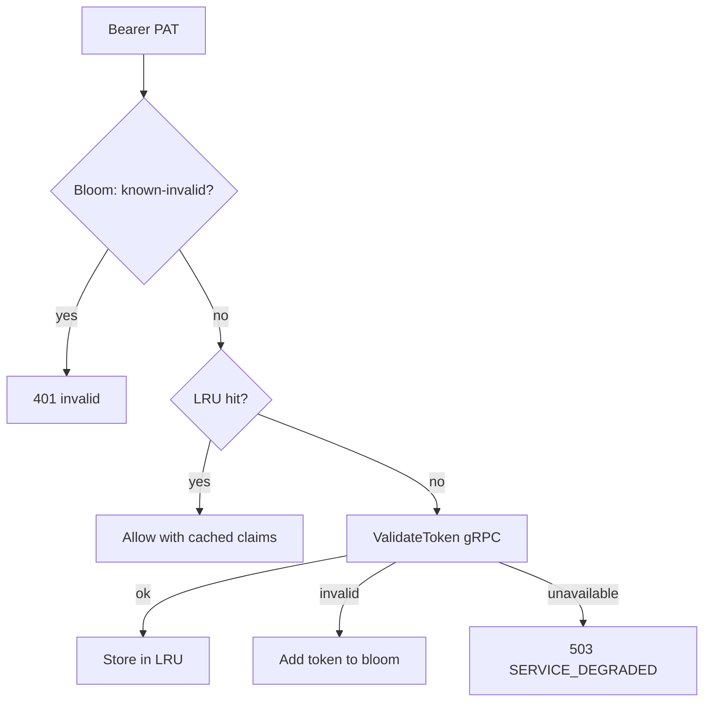

<StatusBadge status="new" /> Auth caching is **shipped** (milestone 2.2.1). Successful `ValidateToken` results may be cached on the proxy behind a bloom filter + LRU, but only when a working Redis revocation channel is available.

Design: [ADR-0028](/docs/adr/0028-auth-cache-design), [ADR-0029](/docs/adr/0029-token-revocation-propagation).

## Safety gate

The proxy **will not** wrap the auth validator with a cache unless:

1. `IBEX_AUTH_CACHE_ENABLED=true` (default), and
2. `REDIS_URL` is set, and
3. Redis `PING` succeeds at startup.

Otherwise it logs `auth cache disabled; revocation channel unavailable` and calls auth gRPC on every request. Skipping the cache never weakens fail-closed auth.

## Hot path

## Revocation

| Side | Behavior |
| --- | --- |
| Auth | After durable revoke, PUBLISH to `ibex:token:revocations` |
| Proxy | SUBSCRIBE; invalidate LRU entry by **token UUID** |

Event schema v1: `{v, token_id, org_id, revoked_at}`. If auth has no Redis URL it uses a Noop publisher (local-only revoke until caches expire by TTL).

## Configuration

| Variable | Default | Role |
| --- | --- | --- |
| `IBEX_AUTH_CACHE_ENABLED` | `true` | Master switch |
| `IBEX_AUTH_CACHE_LRU_CAPACITY` | `5000` | Max cached tokens |
| `IBEX_AUTH_CACHE_LRU_MAX_TTL` | `30s` | Max entry lifetime |
| `IBEX_AUTH_CACHE_BLOOM_EXPECTED_ITEMS` | `10000` | Bloom sizing |
| `IBEX_AUTH_CACHE_BLOOM_FP_RATE` | `0.001` | Bloom false-positive rate |
| `REDIS_URL` | (required for wrap) | Revocation channel + Ping gate |

Auth also needs `REDIS_URL` to publish revokes promptly.

## Fail-closed interaction

| Condition | HTTP |
| --- | --- |
| Auth gRPC down / timeout | `503 SERVICE_DEGRADED` / `AUTH_UNAVAILABLE` |
| Cached invalid / bloom hit | `401` |
| Redis down at startup | Cache not wrapped; every request hits gRPC (still fail-closed on auth outage) |

## Where to look in the repo

- `packages/authcache` — bloom + LRU validator wrapper
- `packages/revocation` — channel constants and Redis pub/sub helpers
- `services/proxy/internal/bootstrap/redis.go` — enablement gate
- `services/auth/internal/service/token_service.go` — publish after revoke

## Related docs

- [Proxy authentication](/docs/proxy/authentication)
- [Security authentication](/docs/security/authentication)
- [Issuing API keys](/docs/auth/issuing-api-keys)
- [Roadmap findings](/roadmap/findings) — supersession of the old deferral note
