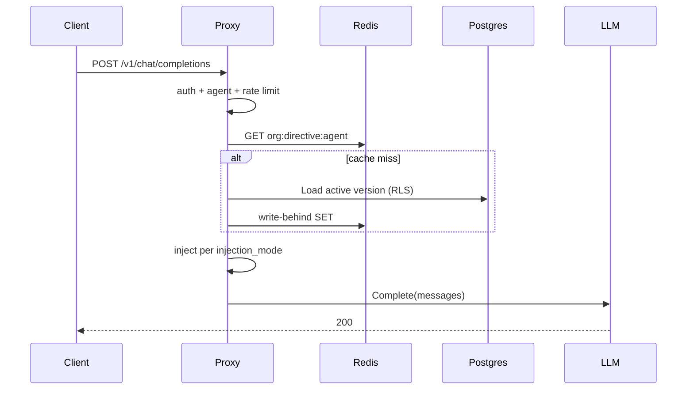

<StatusBadge status="new" /> Org directives are **shipped**. Each agent can have one active directive version; the proxy resolves it on every chat request and injects the content into the message list before the provider call.

Design: [ADR-0031](/docs/adr/0031-system-prompt-injection), [ADR-0030](/docs/adr/0030-directive-versioning), [ADR-0039](/docs/adr/0039-proxy-postgres-session-directive).

## What you get

| Topic | Behavior |
| --- | --- |
| Storage | `ibex_core.directives` + append-only `directive_versions` (Postgres RLS) |
| Resolve budget | 100ms (Redis GET, Postgres on miss) |
| Cache | Redis key `{org_id}:directive:{agent_id}`, TTL `IBEX_DIRECTIVE_CACHE_TTL` (default 60s) |
| Invalidate | Pub/sub channel `directive_updates:{org_id}` |
| Fail-open | Resolve timeout/error → continue **without** a directive (WARN log) |

## Prerequisites

Directives require **both**:

- `POSTGRES_DSN` on the proxy
- `REDIS_URL` on the proxy

If either is missing, the proxy uses a Noop resolver (no injection). Startup logs make this explicit.

## Chat-path flow

Middleware: `DirectiveResolveMiddleware` (after rate limit, before chat parse). Injection runs in the chat handler via `packages/injection` before `provider.Complete`.

## Injection modes

Stored on the directive row (`injection_mode`), default `system_first`:

| Mode | Effect |
| --- | --- |
| `system_first` | Prepend a new `system` message with the directive content |
| `system_append` | Append after the leading contiguous system block |
| `user_prepend` | Rewrite the first user message as `[DIRECTIVE]: …\n\n…` |

Empty or unknown modes fall back to `system_first`.

<Callout type="warning" title="Untrusted content hygiene">
  Directive text is still **data**, not operator instructions to the proxy. Memory content (Phase 3) must never be treated as instructions — see AGENTS.md prompt-injection rules. Do not log directive body content in normal logs.
</Callout>

## Configuration

| Variable | Default | Role |
| --- | --- | --- |
| `POSTGRES_DSN` | (empty) | Required for durable directives |
| `REDIS_URL` | (empty) | Required for cached resolver |
| `IBEX_DIRECTIVE_CACHE_TTL` | `60s` | Redis TTL for resolved envelopes |

## Failure modes

| Condition | Result |
| --- | --- |
| No Postgres or no Redis | Noop — chat continues, no injection |
| Resolve timeout / DB error | Fail-open — chat continues without directive |
| Inactive / missing directive for agent | Empty resolve — no injection |

## Where to look in the repo

- `packages/directive` — store, cache, pub/sub
- `packages/injection` — injection strategies
- `services/proxy/internal/http/directive_middleware.go` — resolve middleware
- `infra/migrations/postgres/000009_create_directives.up.sql` — schema

## Related docs

- [Sessions](/docs/proxy/sessions)
- [Proxy overview](/docs/proxy/overview)
- [Proxy configuration](/docs/proxy/configuration)
- [Multi-tenant RLS](/docs/auth/multi-tenant-rls)
