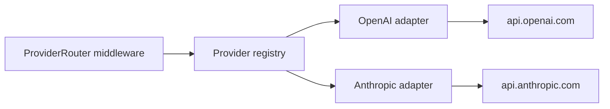

Provider adapters translate normalized IBEX chat requests into upstream LLM API calls and stream responses back to clients. The registry ships with a **mock** adapter (default) and an **OpenAI-compatible** adapter for live mode.

<Callout type="info" title="Modes">
  `IBEX_LLM_MODE=mock` (default) returns HTTP **200** from an in-process stub for registered models.
  Set `IBEX_LLM_MODE=live` and `OPENAI_API_KEY` to forward to an OpenAI-compatible API.
  Unknown models still return `501 PROVIDER_NOT_CONFIGURED`. Design: [ADR-0025](/docs/adr/0025-llm-provider-abstraction),
  [ADR-0026](/docs/adr/0026-openai-client-design), [ADR-0027](/docs/adr/0027-streaming-dual-write).
</Callout>

## Why adapters exist

IBEX Harness must support multiple LLM vendors without leaking provider specifics into middleware. Adapters isolate:

- Upstream URL and authentication (API keys, Azure deployment IDs)
- Request/response dialect differences (tool calls, streaming chunk format)
- Retry and circuit-breaker policy per provider

The proxy critical path stays provider-agnostic: normalize once, delegate to the registry, stream the response. Target overhead remains under 20ms p99 excluding upstream LLM latency — see [Architecture overview](/docs/architecture/overview).



## Planned adapter contract

<ProcessSteps
  steps={[
    {
      title: 'Register at startup',
      description:
        'Each adapter registers a name, supported model prefixes, and a Forward function with the proxy registry.',
    },
    {
      title: 'Receive normalized payload',
      description:
        'Input is the validated OpenAI chat JSON plus org_id, agent_id, and request_id from middleware context.',
    },
    {
      title: 'Call upstream',
      description:
        'Adapter applies provider credentials from org-scoped configuration (never from the client request body).',
    },
    {
      title: 'Stream response',
      description:
        'Return OpenAI-compatible JSON or SSE chunks to the client; accumulate for async trace emission in later phases.',
    },
  ]}
/>

Adapters must not read `org_id` from the request body. Tenant context comes from verified auth middleware only — [Tenant isolation](/docs/security/tenant-isolation).

## Mock vs live behavior

Registered models in mock mode return HTTP **200**. Probe status (not `.error.code`):

<CodeTabs>
  <CodeTab label="curl">
```bash
curl -s -o /tmp/chat.json -w "%{http_code}\n" http://localhost:8080/v1/chat/completions \
  -H "Authorization: Bearer ${IBEX_DEV_TOKEN}" \
  -H "X-IBEX-Agent-ID: ${IBEX_DEV_AGENT_ID}" \
  -H "Content-Type: application/json" \
  -d '{"model":"gpt-4o","messages":[{"role":"user","content":"hi"}]}'
```
  </CodeTab>
  <CodeTab label="PowerShell">
```powershell
$headers = @{
  Authorization = "Bearer $env:IBEX_DEV_TOKEN"
  "Content-Type" = "application/json"
  "X-IBEX-Agent-ID" = $env:IBEX_DEV_AGENT_ID
}
$body = '{"model":"gpt-4o","messages":[{"role":"user","content":"hi"}]}'
(Invoke-WebRequest -Uri http://localhost:8080/v1/chat/completions -Method POST -Headers $headers -Body $body).StatusCode
```
  </CodeTab>
</CodeTabs>

Expected output: `200`.

<Callout type="success" title="Default mock returns 200">
  Registered models in mock mode return HTTP 200. Use `make dev-smoke` for the local happy path. A 501 means the model id is not registered — check spelling or `IBEX_LLM_EXTRA_MODELS`.
</Callout>

## Error envelope (unknown model)

```json
{
  "error": {
    "code": "PROVIDER_NOT_CONFIGURED",
    "message": "No LLM provider adapter is configured for this request",
    "request_id": "0192a3b4-c5d6-7890-abcd-ef1234567890",
    "timestamp": "2026-06-14T12:00:00Z"
  }
}
```

This is distinct from `503` dependency failures — the proxy itself is healthy; the requested **model** is not in the active registry.

## What still evolves

<Steps>
  <Step title="Registry (shipped)">
    Model-to-adapter resolution for mock and OpenAI-compatible live modes.
  </Step>
  <Step title="OpenAI adapter (shipped)">
    Non-streaming JSON and streaming SSE dual-write ([ADR-0027](/docs/adr/0027-streaming-dual-write)).
  </Step>
  <Step title="Circuit breaker">
    Provider 5xx triggers breaker; clients receive `503` with `Retry-After` (hardening continues).
  </Step>
  <Step title="Memory injection">
    Parallel memory retrieval before upstream call remains Phase 3 — directives already inject today.
  </Step>
</Steps>

Provider API keys are server-side (`OPENAI_API_KEY` / future org vault) — never accepted from client headers. Rotation guidance: [Secrets and keys](/docs/security/secrets-and-keys).

## Security boundaries

| Control | Today |
| --- | --- |
| Client supplies provider API key | **Forbidden** |
| Org from token | Enforced |
| Audit log per upstream call | ClickHouse traces when `CLICKHOUSE_DSN` set |
| PII in upstream prompts | Validated locally; memory redaction is Phase 3 |

## Verify adapters

```bash
make compose-dev-up
make db-migrate && make db-seed
make dev-smoke   # asserts mock chat success without OPENAI_API_KEY
```

Integration tests in `services/proxy/` cover mock success and `PROVIDER_NOT_CONFIGURED` for unknown models.

## Related

- [Request routing](/docs/proxy/request-routing) — normalization before adapter handoff
- [Overview](/docs/proxy/overview) — middleware and failure modes
- [Architecture services](/docs/architecture/services) — proxy role in the system map
- [Roadmap Phase 2](/roadmap/phase-2-single-provider) — exit-gate timeline
