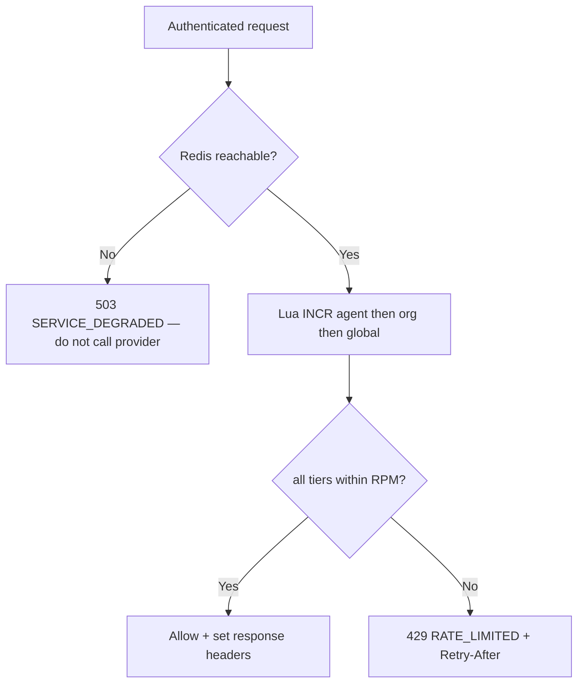

The proxy enforces hierarchical requests-per-minute (RPM) limits (agent → org → global) using an atomic Redis Lua script ([ADR-0015](/docs/adr/0015-proxy-rate-limit-skeleton), milestone 4.B.1). Limits apply **after** authentication and agent verification succeed and **before** request normalization hands off to a provider adapter.

Shared rate limiting is an enforced control for provider traffic. Outside local development, `REDIS_URL` is required; a Redis operation failure returns `503 SERVICE_DEGRADED` and does not call a provider. A quota denial remains `429 RATE_LIMITED`. See [ADR-0081](/docs/adr/0081-fail-closed-proxy-runtime-controls); the Phase 1 fail-open choice in [ADR-0015](/docs/adr/0015-proxy-rate-limit-skeleton) is historical and superseded for the current Proxy runtime.

<Callout type="warning" title="Redis is an availability dependency">
  When Redis is unreachable, affected protected requests are rejected with 503 rather than sent to a provider without the configured shared limit. Restore Redis or disable the affected Proxy capability; do not bypass rate limiting. Local development may explicitly omit Redis and use the Noop limiter.
</Callout>

## How it works



Implementation lives in `packages/ratelimit` (`HierarchicalLimiter`) — services must use the `Limiter` interface, not ad-hoc Redis calls. Org key format remains `ratelimit:{org_id}:rpm:{unix_minute}` with a TTL on first increment; agent and global keys use the same minute window.

## Configuration

<ParamTable
  params={[
    {
      name: "IBEX_RATE_LIMIT_DEFAULT_RPM",
      type: "integer",
      required: false,
      description: "Default requests per minute for orgs without an override (also default agent RPM until 4.B.2).",
      defaultValue: "60",
    },
    {
      name: "IBEX_RATE_LIMIT_GLOBAL_RPM",
      type: "integer",
      required: false,
      description:
        "Shared RPM ceiling across all proxy instances using the same Redis namespace/deployment (applies to all orgs).",
      defaultValue: "100000",
    },
    {
      name: "IBEX_RATE_LIMIT_ORG_OVERRIDES",
      type: "string",
      required: false,
      description:
        "Comma-separated org_uuid=rpm pairs. Example: 550e8400-e29b-41d4-a716-446655440000=120",
    },
    {
      name: "REDIS_URL",
      type: "string (URL)",
      required: true,
      description: "Redis connection used by the limiter and /ready probe.",
    },
  ]}
/>

Example overrides:

```bash
IBEX_RATE_LIMIT_DEFAULT_RPM=60
IBEX_RATE_LIMIT_GLOBAL_RPM=100000
IBEX_RATE_LIMIT_ORG_OVERRIDES=00000000-0000-0000-0000-000000000001=120,00000000-0000-0000-0000-000000000002=30
```

Org IDs in overrides must be valid UUIDs. The limiter resolves the org from the **authenticated token**, never from the request body.

## Response headers

When rate limiting is active and Redis is healthy, allowed protected responses include:

| Header | Meaning |
| --- | --- |
| `X-RateLimit-Limit` | Configured RPM for this org |
| `X-RateLimit-Remaining` | Requests left in the current window |
| `X-RateLimit-Reset` | Unix timestamp when the window resets |

On `429`, the proxy also sets `Retry-After` (seconds) so clients can back off without guessing.

On a rate-limit infrastructure failure, the proxy returns `503 SERVICE_DEGRADED`; this must not be represented as a `429` or as an allowed request.

## Rate-limited error envelope

```json
{
  "error": {
    "code": "RATE_LIMITED",
    "message": "Rate limit exceeded",
    "request_id": "0192a3b4-c5d6-7890-abcd-ef1234567890",
    "timestamp": "2026-06-14T12:00:00Z"
  }
}
```

The `request_id` matches `X-Request-ID` on the response and is propagated to auth gRPC metadata for log correlation ([ADR-0017](/docs/adr/0017-request-id-strategy)).

## Routes subject to limiting

All protected `/v1/*` routes share the same org-level bucket in Phase 1:

- `GET /v1/internal/auth-probe`
- `GET /v1/orgs/{org_id}/auth-probe`
- `POST /v1/chat/completions`

There is no per-agent or per-IP tier yet. Hierarchical limits (agent → org → global) are planned for [Phase 4](/roadmap/phase-4-multi-provider).

## Verify the limiter

<Steps>
  <Step title="Start test stack">
    `make compose-test-up` — Postgres on 5433; Redis from compose.
  </Step>
  <Step title="Run security tests">
    `go test -tags=integration -run TestSecurity_SEC4 ./services/proxy/...`
  </Step>
  <Step title="Optional smoke burst">
    `make dev-smoke` may WARN if 429 is not observed in 65 rapid probe requests — acceptable on fast hardware.
  </Step>
</Steps>

CI exercises both a normal shared-limit decision and Redis-failure rejection, including an assertion that the next handler is not called. See [Testing strategy](/docs/architecture/request-lifecycle) and [current state](/roadmap/current-state).

## Operational guidance

<Callout type="tip" title="Monitor limiter availability">
  Alert on Redis `/ready` failures and `ibex_proxy_rate_limit_redis_errors_total`. The intentional availability trade-off is a 503 on protected work until shared limiter state is restored.
</Callout>

- **Staging:** Keep `IBEX_RATE_LIMIT_DEFAULT_RPM` low enough to catch runaway integration tests.
- **Production:** Set per-org overrides for high-traffic tenants; never embed org IDs in metric labels (cardinality explosion).
- **Security:** Pair rate limits with auth — unauthenticated traffic should not reach the limiter on protected routes.

## Related

- [Configuration](/docs/proxy/configuration) — full env var reference
- [Authentication](/docs/proxy/authentication) — limiter runs after auth succeeds
- [Tenant isolation](/docs/security/tenant-isolation) — Redis key namespacing by org_id
- [ADR-0015](/docs/adr/0015-proxy-rate-limit-skeleton) — design rationale and race window
