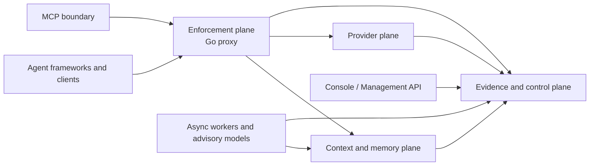

# Target Topology and Trust Boundaries

**Status:** `design-intent` / target; not a deployment guarantee.

## Planes

### Enforcement plane

Owns request limits, verified principal propagation, deterministic authorization, policy epoch, capability admission, reservations, rate/concurrency controls, bounded context calls, provider selection, streaming, and final allow/deny. It does not extract memory, run deep PII, render dashboards, or trust classifier output.

### Context and memory plane

Owns sessions/checkpoints, typed memory, retrieval, PII/quarantine, embeddings, context compilation, and provenance-bearing manifests. It receives verified identity and policy context. It cannot widen visibility or promote a candidate to authority.

### Provider plane

Owns immutable deployment identities, provider adapters, capability manifests, tokenizer/pricing metadata, streaming normalization, usage reconciliation, retries, and breakers. It cannot authorize a tenant or override a reservation.

### Evidence and control plane

Owns canonical configuration, policy/directive lifecycle, provider registry, reservations, operation state, deletion state, transactional outbox, artifact metadata, and recovery. ClickHouse, object storage, Redis, queues, and OTel are projections/transports unless explicitly designated otherwise.

### Operator and MCP surfaces

The management API and Console/BFF are clients of the control plane. MCP is a narrow authenticated resource/tool boundary, not an OAuth identity provider or direct database interface. Dashboard is compatibility-only until an ADR changes that status.

### Async intelligence

Workers perform extraction, embedding, reindexing, deep PII, conflict proposals, evaluation, and optional model classification. They emit candidates and recommendations. Deterministic executors or explicitly authorized operators apply consequential changes.

## Deployment profiles

| Profile | Intended use | Guarantee boundary |
|---|---|---|
| Development Compose | Local contributor workflow | Convenience; no production availability claim. |
| Single-node self-hosted | Small controlled installation | Explicit backup, resource, and dependency limits. |
| HA production | Hosted or engineered production | Requires recovery, isolation, SLO, and operator evidence. |

The profile must be recorded with every acceptance result. A feature accepted in Compose is not automatically accepted in HA production.
